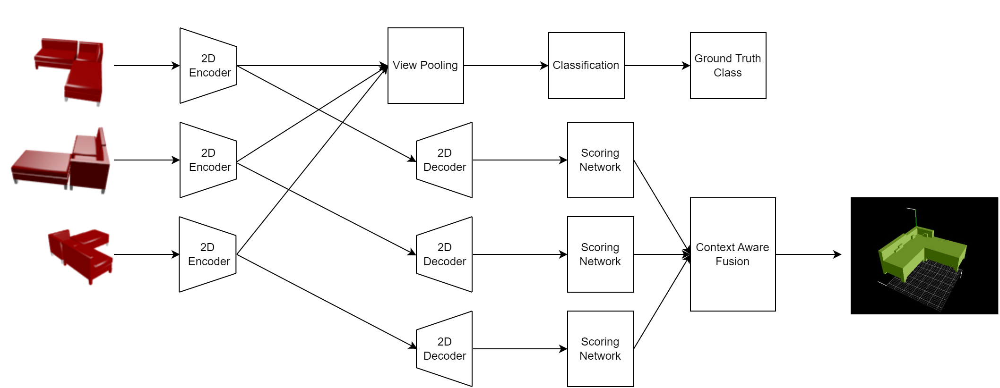

# 3DMV - Multi-View Convolutional Neural Networks for 3D Shape Recognition: Reconstruction from multiple views
This project is for the course "Machine learning for 3D Geometry" offered by Techninal University of Munich in Winter semester 2021/2022.

Deep learning methods in Multi-view representation of objects have been drawing a lot of attention in recent years. Multi-view Convolutional Neural Networks for 3D Shape Recognition, Su et al. 2015 showed how we can employ fea- tures from 2D Convolution Network of multiple image views to enhance classification quality in comparison to state-of- the-art 3D shape descriptors. In this project, we propose how to do Object Classification and 3D Reconstruction at the same time, by adding a Reconstruction head with 3D Voxels decoder and fusion network, that combines the voxel output of each view, taking the idea from Pixel2Vox (Xie et al. 2019).

### Authors
* Baris Zongur
* Cuong Ha
* Micheal Stark
* Tobias Preintner

:zap: <em>Equal contribution.</em>
